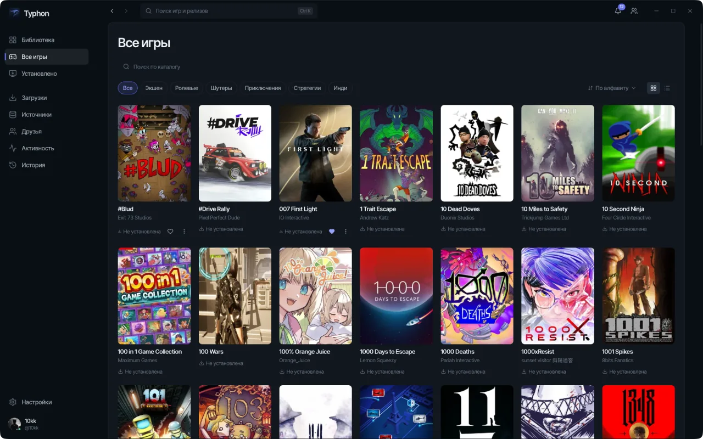

# Typhon

*Читать [по-русски](README.ru.md).*

**Your games. One launcher.**

Think of a game, open your library, pick up where you left off. Typhon brings your installed games together with covers and descriptions, helps you download new ones and keeps available updates in view. Spend less time digging through folders and more time playing.

[](https://typhon-launcher.com/download/)

**[Download Typhon](https://typhon-launcher.com/en/download/)** · [Explore the website](https://typhon-launcher.com/en/) · [What’s new](CHANGELOG.en.md)

For Windows and Apple Silicon Macs. No account needed to use your library.


## Why try it?

- **See your whole collection.** Find games on your drives and launch them from one library. See what is installed, how much space it takes and what you played recently.
- **From download to play.** Built-in BitTorrent downloads with a queue and a speed limit. Typhon checks the files and helps you install the game when the download finishes.
- **Keep track of updates.** When a source you added offers a newer game version, Typhon shows it alongside your installed copy.
- **Find your next game.** Covers, descriptions, genres and screenshots remind you why a game caught your eye in the first place.
- **Take your library with you.** Move it to another drive or transfer an installed game to another computer on your local network.
- **Bring your friends along.** An optional account adds a profile, friends, online status, an activity feed and library and settings sync between computers. Account sync does not transfer game files.

The interface is available in English and Russian, with themes, playtime tracking and Discord Rich Presence.

| Your collection | A closer look |
|---|---|
|  |  |

## Get started

1. [Download the build for your system](https://typhon-launcher.com/en/download/). The download page shows the published version and the file’s SHA-256 checksum.
2. Install Typhon and choose a folder for your library.
3. Find games already on your drives, or add your own source for downloads.
4. Pick a game and launch it from your library. You can add an account later.

Typhon ships without games or a ready-made list of sources. You choose and add sources yourself and are responsible for having the right to use their content.

## System requirements

| System | What you need |
|---|---|
| Windows | Windows 10 1809 or newer, x64, Microsoft Edge WebView2 Runtime. The download is an `.exe` installer. |
| macOS | macOS 13 or newer, Apple Silicon (M1 and later). Installing and running Windows games requires CrossOver, a separate paid application; compatibility varies by game. |

There are no Intel Mac or Linux builds yet. The macOS app has no Apple Developer signature; see the [download page](https://typhon-launcher.com/en/download/) for first-launch instructions.

## Your library and your data

Your library, sources and downloads live on your computer. Installed games can be launched without signing in; cached covers and descriptions remain available locally.

Typhon uses a metadata service for new covers and descriptions, and an account enables sync and social features. BitTorrent peers can see your IP address. There is a separate service activity signal; usage statistics and error reports are controlled through privacy settings. See the [privacy policy](PRIVACY.en.md) for details.

Game data provided by IGDB. Typhon is not affiliated with or endorsed by IGDB or Twitch.

## Feedback and development

Found a bug or have an idea? [Open an issue](https://github.com/10kkyvl/Typhon-Launcher/issues) with what you were trying to do and what happened. Review logs before posting them publicly.

The source is available to read. Terms and third-party notices: [TERMS.en.md](TERMS.en.md), [COPYRIGHT.en.md](COPYRIGHT.en.md), [THIRD_PARTY_NOTICES.en.md](THIRD_PARTY_NOTICES.en.md).

<details>
<summary>Build, development and contribution guide</summary>

# Building it yourself

Everything below is for working on the launcher, not for using it.

## Requirements

| | |
|---|---|
| Go | 1.25.0 |
| Node | 22 |
| Wails CLI | `v3.0.0-beta.17` — `go install github.com/wailsapp/wails/v3/cmd/wails3@v3.0.0-beta.17` |

Go + [Wails 3](https://v3.wails.io) on the backend, Svelte 5 on the front, checkout version in [`VERSION`](VERSION).

```
wails3 task build          # bin/typhon.exe
wails3 task run
wails3 task dev            # hot reload, vite on port 9245
wails3 task package        # production package
```

Cross-compiling from macOS or Linux with `CGO_ENABLED=1` switches to a Docker builder
(`wails3 task setup:docker` prepares the image).

## Developing on macOS or Linux

The `devmock` build tag swaps the Windows-only subsystems — installer runner, game
process execution and detection, credential store, desktop shortcuts — for mocks, so the
whole flow can be exercised off Windows.

```
wails3 task dev:devmock
wails3 task run:devmock
wails3 task test:devmock
```

The tag can never reach a shipped binary: `internal/devmock/forbid_devmock.go` fails the
build outright when `devmock` is combined with `GOOS=windows` or with the `production`
tag, CI asserts both failures, and the release workflow greps the built `.exe` for the
`TYPHON_DEVMOCK_ENABLED` marker.

Mock behaviour is tuned with `TYPHON_DEVMOCK_ELEVATE` (`1` — go through the elevated
worker protocol, `0` — install directly), `TYPHON_DEVMOCK_INSTALL_SECONDS` (default `2`),
`TYPHON_DEVMOCK_GAME_SECONDS` (default `60`), and, for the local self-update server
started by `wails3 task devrelease VERSION=x.y.z`, `TYPHON_DEVMOCK_MANIFEST_URL` and
`TYPHON_DEVMOCK_RELEASE_PUBKEY`.

## Configuration

| Variable | Meaning |
|---|---|
| `TYPHON_API_URL` | Backend base URL. Default `https://api.typhon-launcher.com`. Must be `https`; plain `http` is accepted only for `127.0.0.1` and `localhost`, and the bearer token is never sent over an unencrypted connection. |
| `TYPHON_API_TOKEN` | A session token to use instead of the OS credential store. For development. |

On disk:

| | |
|---|---|
| Config directory | `%AppData%\Typhon` (`os.UserConfigDir()/Typhon`) |
| Settings | `<config>/settings.json` |
| Account state | `<config>/account.json` |
| Log | `<config>/typhon.log`, rotated at 10 MiB, five backups |
| Library | `<folder you pick>/TyphonLibrary`, with `Games`, `Downloads` and `Screenshots` inside |

There is no default library path: nothing is written until you pick a parent folder in
the launcher.

## Tests and checks

The full set CI runs — everything here has to pass before a change is finished:

```
gofmt -l .                                   # must print nothing
go vet . ./internal/...
go build . ./internal/...
GOOS=windows CGO_ENABLED=0 go build . ./internal/...
go test ./internal/...
CGO_ENABLED=1 go test -race ./internal/...
CGO_ENABLED=1 go test -race -tags devmock ./internal/...
golangci-lint run --new-from-rev=origin/dev --whole-files=false ./...
go run ./tools/lintbaseline                  # and: -tags devmock
```

New and changed code must be clean; the whole module is measured against the per-OS
baseline in `.github/lint-baseline.txt` (keyed by `GOOS`, or `GOOS+tags`), and that
number may only go down. `golangci-lint` is pinned to v2.13.1 —
`wails3 task lint:install` puts it in place.

Frontend, from `frontend/`:

```
npm ci
npm run check       # svelte-check
npm run test        # vitest
npm run build
```

Bindings between Go and the frontend are generated:
`wails3 task common:generate:bindings`.

## Layout

```
main.go            wiring: every service is constructed and bound here
internal/          the launcher itself, one package per subsystem
frontend/          Svelte 5 + Vite; src/routes is one directory per screen
frontend/src/lib/i18n    the locale layer and the ru/en message catalogs
build/             per-OS Taskfiles, icons, packaging config
tools/             devrelease, lintbaseline, third-party notices generator
cmd/signrelease    signs an update manifest with the release key
```

`internal/` by subsystem:

| Area | Packages |
|---|---|
| Games | `catalog`, `sources`, `download`, `install`, `library`, `discovery`, `updates`, `metadata`, `relocate`, `lan`, `search`, `hashdir`, `titles`, `shortcut`, `playlog`, `history` |
| Account | `account`, `accountsync`, `social`, `online`, `presence`, `discord`, `heartbeat`, `profile` |
| Updating itself | `selfupdate` |
| Windows | `platform`, `autostart`, `tray`, `procs`, `devmock` |
| Infrastructure | `settings`, `storage`, `redact`, `uierr`, `diagnostics`, `usagestats`, `telemetrylog`, `theme`, `clientid`, `legal`, `version` |

Two of those are load-bearing rules rather than features. `storage` holds the single
atomic-write primitive the whole repository uses — no package writes state files by
itself. `uierr` attaches a stable code to every error that reaches the interface, so the
frontend maps codes to translated text instead of matching Russian substrings; a test in
each package fails if a code exists on one side and not the other.

## Contributing

`main` is the stable branch, `dev` is where work lands; features branch off `dev` and
reach `main` through a merge.

- **Everything that goes to git and GitHub is written in English** — commit messages,
  branch names, pull request titles and bodies, review comments, issues, tags, release
  notes. Russian stays in the interface, in user-facing error text, and in conversation.
- Commit subject: `type: subject`, lower case, imperative, no trailing period. The body
  wraps at 72 columns and explains *why*, rather than restating the diff.
- The checklist above is the gate. A change is not finished because it looks right — run
  the commands and show what they printed. New code with a `-race` failure, a raised
  lint baseline, or a test marked `t.Skip` to get past it, is not finished either.
- User-visible strings go through the locale layer in both languages, never hardcoded.
  An error that reaches the interface gets a `uierr` code and an entry in both catalogs.
- `CHANGELOG.md` is Russian on purpose: its text goes into the signed update manifest and
  is shown in the launcher under "What's new". The top entry must match `VERSION`.
- The invariants the code is held to — atomic writes, errors that never become default
  values, crash-safe data moves — are written out in `CLAUDE.md`. It is worth reading
  before a first change.

Bugs and questions: [GitHub issues](https://github.com/10kkyvl/Typhon-Launcher/issues).
A launcher log from `%AppData%\Typhon\typhon.log` helps; it is redacted of paths and
account details by design.

## Licence

There is no licence file in this repository yet, so default copyright applies: the source
is here to be read and built, not licensed for reuse or redistribution. Ask before
building on it.

The licences of the components Typhon bundles are in
[`THIRD_PARTY_NOTICES.md`](THIRD_PARTY_NOTICES.md), generated from `tools/notices`.
`wails3 task legal:check` verifies a release carries all of the legal documents.

## The rest of the project

- [`typhon-backend`](https://github.com/10kkyvl/typhon-backend) — accounts, catalog, sync, social and the update feed
- [`typhon-site`](https://github.com/10kkyvl/typhon-site) — the website and the download page

</details>
