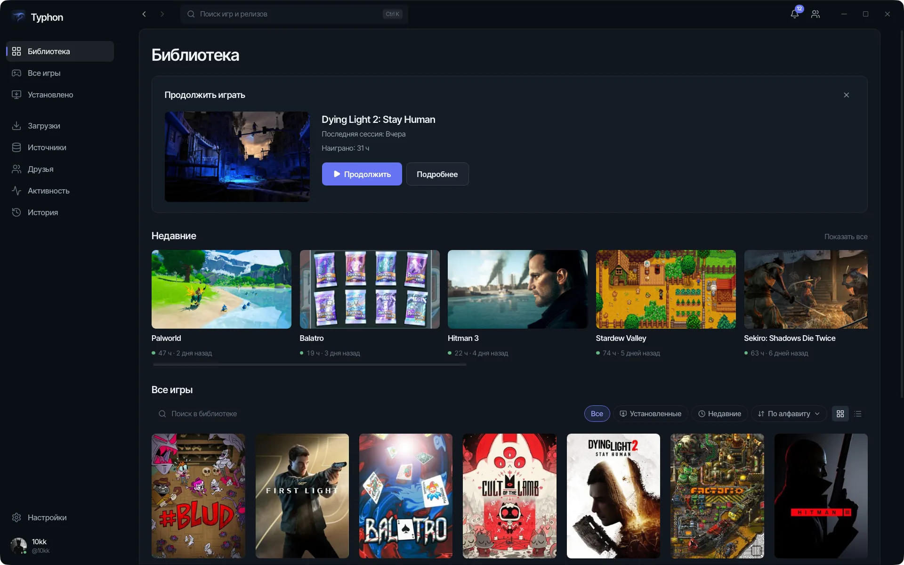
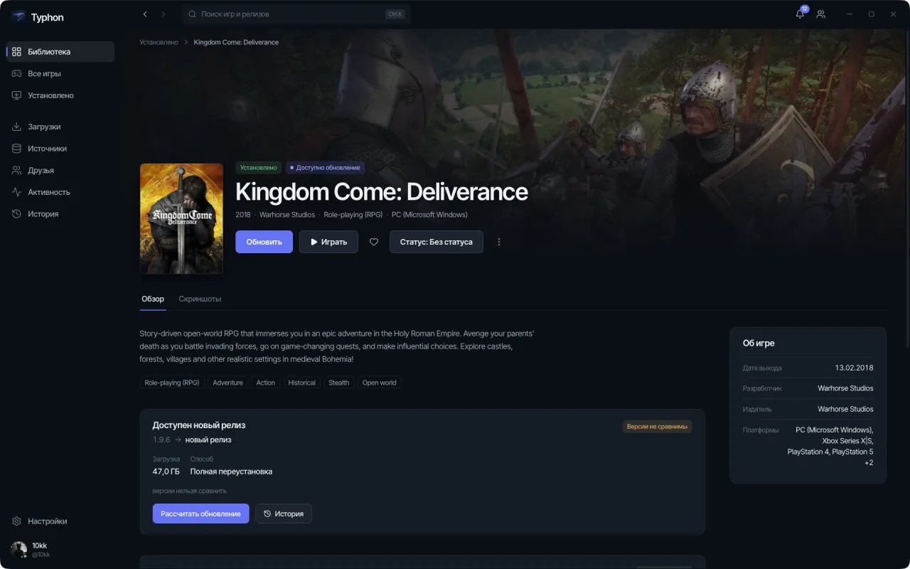
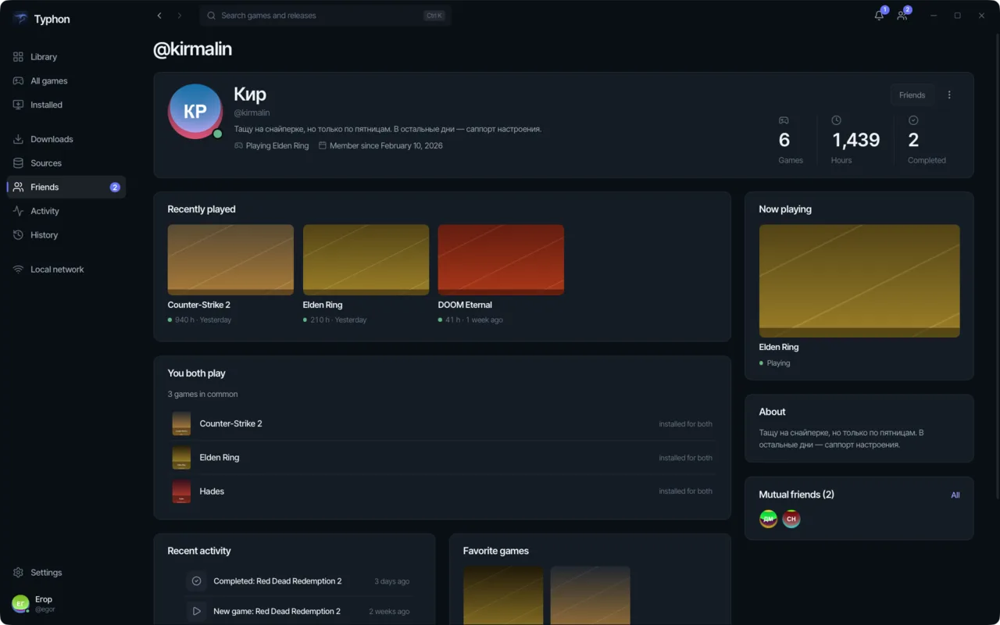
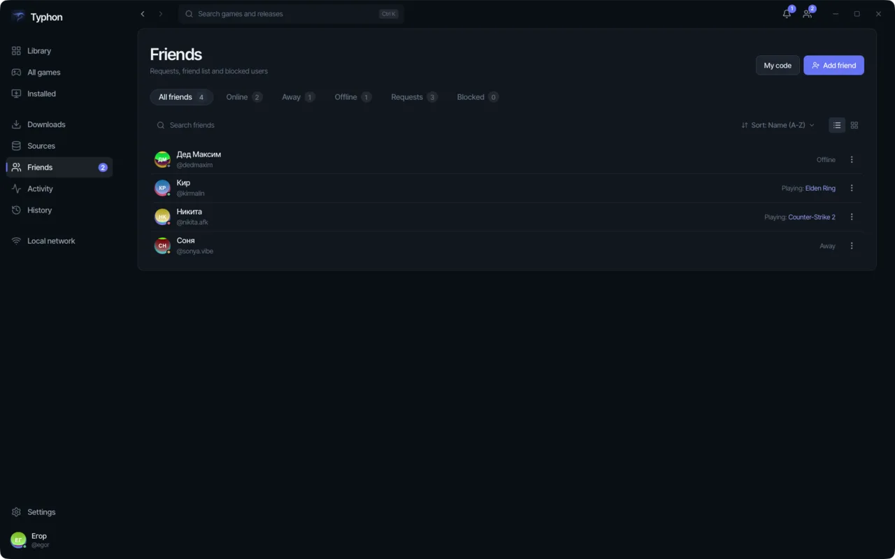

# Typhon

*[In English](README.md).*

Лаунчер игр для Windows. Typhon находит игры, которые уже стоят на дисках, скачивает и
устанавливает новые, показывает версии и запускает всё из одной библиотеки.

**[Скачать](https://typhon-launcher.com/download/)** · [typhon-launcher.com](https://typhon-launcher.com)
· Windows 10 версии 1809 или новее, 64-разрядная, с Microsoft Edge WebView2 Runtime

Приложение портативное: скачанный файл запускается напрямую, установщик не нужен, а своё
состояние он держит в `%AppData%\Typhon`. Перед запуском сверьте SHA-256, напечатанный
рядом со ссылкой на скачивание.



| | |
|---|---|
|  |  |
|  | |

## Чем Typhon не является

Typhon не поставляется с играми, не содержит предустановленных источников и не предлагает
их список. Он не размещает и не поставляет игровые файлы. Источники добавляет
пользователь самостоятельно и под собственную ответственность.

Сборка одна — под Windows. Версий для macOS и Linux нет, и они не появятся, пока не
появится рабочая сборка: лаунчер на macOS *разрабатывают* (см.
[ниже](#разработка-на-macos-и-linux)), но пользоваться этим нельзя.

## Что умеет

**Библиотека собирается сама.** Typhon сканирует диски и находит установленные игры; всё,
что поставлено через него, попадает в библиотеку сразу. У каждой игры видно версию,
размер, дату установки и время в игре. Игру можно убрать из библиотеки, не удаляя файлы.

**Загрузки.** Встроенный BitTorrent-клиент: очередь, лимит скорости, проверка файлов.
Прогресс хранится на диске по кускам, поэтому закрытый на середине лаунчер продолжает
загрузку с места остановки, а не перепроверяет всё заново.

**Установка и обновления.** Распаковывает архивы, запускает установщики и помнит, какие
файлы поставил. Если в источнике появился релиз новее установленного, игра помечается в
списке — оттуда её можно обновить, запустить или удалить. Патчи применяются по одному с
резервной копией заменяемого, а обновление, прерванное выключением питания, на следующем
запуске доводится до конца или откатывается, а не оставляет папку игры недописанной.

**Метаданные.** Typhon ищет карточку по названию и подставляет обложку, описание, дату
выхода, жанры, разработчика, издателя и скриншоты. Всё скачанное остаётся в локальном кэше
и открывается без сети. Данные об играх предоставлены IGDB; Typhon не связан с IGDB и
Twitch и не одобрен ими.

**Аккаунт — если он вам нужен.** Лаунчер полностью работает и гостем. Если войти,
появляются профиль с витриной и временем в играх, друзья по нику или коду друга, статус
онлайн, лента активности и синхронизация библиотеки, отметок и настроек между
компьютерами. Пропавшая сеть переводит на кешированный профиль, а не выкидывает из
аккаунта.

**Остальное.** Discord Rich Presence, передача установленной игры другому компьютеру в
той же локальной сети, переезд библиотеки на другой диск с проверкой по хешу, история
действий лаунчера, темы вплоть до своего CSS и подписанное самообновление, которое
докачивается после обрыва.

**Русский и английский.** Весь интерфейс на обоих языках, по умолчанию — как в системе.

## Ваши данные

Библиотека, источники, загрузки и установки хранятся на компьютере. Magnet-ссылки,
infohash, списки файлов и история загрузок сервисам Typhon не передаются.

Что уходит наружу: название игры — сервису метаданных Typhon, который запрашивает карточку
в IGDB. Фид источника Typhon берёт напрямую с указанного вами хоста, минуя свои серверы.
При загрузке через BitTorrent ваш IP-адрес виден другим участникам раздачи. Диагностика и
статистика использования — только с согласия, и то, что реально ушло, видно в самом
лаунчере.

Полные тексты: [`PRIVACY.md`](PRIVACY.md), [`TERMS.md`](TERMS.md),
[`COPYRIGHT.md`](COPYRIGHT.md) (у каждого есть перевод `.en.md`). При расхождении перевода
с оригиналом действует русский текст.

---

# Сборка своими руками

Всё, что ниже, — для работы над лаунчером, а не для пользования им.

## Что нужно

| | |
|---|---|
| Go | 1.25.0 |
| Node | 22 |
| Wails CLI | `v3.0.0-beta.10` — `go install github.com/wailsapp/wails/v3/cmd/wails3@v3.0.0-beta.10` |

Go + [Wails 3](https://v3.wails.io) на бэкенде, Svelte 5 на фронте, текущая версия 0.3.1.

```
wails3 task build          # bin/typhon.exe
wails3 task run
wails3 task dev            # hot reload, vite на порту 9245
wails3 task package        # релизная упаковка
```

Кросс-сборка с macOS или Linux при `CGO_ENABLED=1` уходит в докер-сборщик (образ готовит
`wails3 task setup:docker`).

## Разработка на macOS и Linux

Тег сборки `devmock` подменяет Windows-подсистемы — запуск установщика, запуск и
отслеживание игры, хранилище учётных данных, ярлыки — моками, так что весь путь можно
прогнать не на Windows.

```
wails3 task dev:devmock
wails3 task run:devmock
wails3 task test:devmock
```

В релизный бинарь тег не попадёт физически: `internal/devmock/forbid_devmock.go` роняет
сборку, если `devmock` совмещён с `GOOS=windows` или с тегом `production`, CI проверяет
оба падения, а релизный workflow ищет в собранном `.exe` маркер `TYPHON_DEVMOCK_ENABLED`.

Поведение моков настраивается: `TYPHON_DEVMOCK_ELEVATE` (`1` — идти через протокол
привилегированного воркера, `0` — ставить напрямую), `TYPHON_DEVMOCK_INSTALL_SECONDS` (по
умолчанию `2`), `TYPHON_DEVMOCK_GAME_SECONDS` (по умолчанию `60`), а для локального сервера
обновлений из `wails3 task devrelease VERSION=x.y.z` — `TYPHON_DEVMOCK_MANIFEST_URL` и
`TYPHON_DEVMOCK_RELEASE_PUBKEY`.

## Настройка

| Переменная | Что делает |
|---|---|
| `TYPHON_API_URL` | Адрес бэкенда. По умолчанию `https://api.typhon-launcher.com`. Только `https`; голый `http` принимается лишь для `127.0.0.1` и `localhost`, и токен по незашифрованному соединению не уходит никогда. |
| `TYPHON_API_TOKEN` | Токен сессии вместо системного хранилища учётных данных. Для разработки. |

На диске:

| | |
|---|---|
| Каталог настроек | `%AppData%\Typhon` (`os.UserConfigDir()/Typhon`) |
| Настройки | `<config>/settings.json` |
| Состояние аккаунта | `<config>/account.json` |
| Лог | `<config>/typhon.log`, ротация на 10 МиБ, пять копий |
| Библиотека | `<выбранная папка>/TyphonLibrary`, внутри `Games`, `Downloads`, `Screenshots` |

Пути библиотеки по умолчанию нет: пока папка не выбрана в лаунчере, на диск ничего не
пишется.

## Тесты и проверки

Полный набор, который гоняет CI, — всё это должно проходить до того, как задача считается
сделанной:

```
gofmt -l .                                   # вывод должен быть пустым
go vet . ./internal/...
go build . ./internal/...
GOOS=windows CGO_ENABLED=0 go build . ./internal/...
go test ./internal/...
CGO_ENABLED=1 go test -race ./internal/...
CGO_ENABLED=1 go test -race -tags devmock ./internal/...
golangci-lint run --new-from-rev=origin/dev --whole-files=false ./...
go run ./tools/lintbaseline                  # и: -tags devmock
```

Новый и изменённый код обязан быть чистым; весь модуль меряется против базиса в
`.github/lint-baseline.txt` (ключ — `GOOS` или `GOOS+теги`), и это число может только
уменьшаться. Версия `golangci-lint` закреплена — v2.13.1, ставит её
`wails3 task lint:install`.

Фронтенд, из `frontend/`:

```
npm ci
npm run check       # svelte-check
npm run test        # vitest
npm run build
```

Связки между Go и фронтом генерируются: `wails3 task common:generate:bindings`.

## Структура

```
main.go            сборка: здесь конструируется и связывается каждый сервис
internal/          сам лаунчер, по пакету на подсистему
frontend/          Svelte 5 + Vite; src/routes — по каталогу на экран
frontend/src/lib/i18n    слой локализации и каталоги сообщений ru/en
build/             Taskfile под каждую ОС, иконки, конфиг упаковки
tools/             devrelease, lintbaseline, генератор уведомлений о зависимостях
cmd/signrelease    подписывает манифест обновления релизным ключом
```

`internal/` по подсистемам:

| Область | Пакеты |
|---|---|
| Игры | `catalog`, `sources`, `download`, `install`, `library`, `discovery`, `updates`, `metadata`, `relocate`, `lan`, `search`, `hashdir`, `titles`, `shortcut`, `playlog`, `history` |
| Аккаунт | `account`, `accountsync`, `social`, `online`, `presence`, `discord`, `heartbeat`, `profile` |
| Самообновление | `selfupdate` |
| Windows | `platform`, `autostart`, `tray`, `procs`, `devmock` |
| Инфраструктура | `settings`, `storage`, `redact`, `uierr`, `diagnostics`, `usagestats`, `telemetrylog`, `theme`, `clientid`, `legal`, `version` |

Два пакета из этого списка — не столько функциональность, сколько правило. В `storage`
лежит единственная на весь репозиторий функция атомарной записи: свои копии в пакетах
запрещены. `uierr` вешает стабильный код на каждую ошибку, доезжающую до интерфейса, чтобы
фронт переводил по коду, а не искал подстроки в русском тексте; в каждом пакете есть тест,
который падает, если код есть с одной стороны и нет с другой.

## Как участвовать

`main` — стабильная ветка, `dev` — рабочая; фичи ответвляются от `dev` и попадают в `main`
через merge.

- **Всё, что уходит в git и на GitHub, пишется по-английски** — сообщения коммитов, имена
  веток, заголовки и тела PR, комментарии в ревью, issue, теги, release notes. Русский
  остаётся в интерфейсе, в текстах ошибок для пользователя и в переписке.
- Заголовок коммита: `type: subject`, нижний регистр, повелительное наклонение, без точки
  в конце. Тело — по 72 символа в строке, объясняет «почему», а не пересказывает diff.
- Чеклист выше — это ворота. Правка не считается сделанной потому, что выглядит верной:
  команды нужно запустить и показать их вывод. Новый код с падением под `-race`, с
  выросшим базисом линтера или с тестом, помеченным `t.Skip` ради прохода, тоже не
  считается сделанным.
- Строки, которые видит пользователь, идут через слой локализации на обоих языках, а не
  хардкодом. Ошибка, доезжающая до интерфейса, получает код `uierr` и запись в обоих
  каталогах.
- `CHANGELOG.md` русский намеренно: его текст попадает в подписанный манифест обновления и
  показывается в лаунчере в разделе «Что нового». Верхняя запись обязана совпадать с
  `VERSION`.
- Инварианты, которым обязан следовать код, — атомарная запись, ошибка, которая никогда не
  превращается в значение по умолчанию, безопасное к аварии перемещение данных — выписаны
  в `CLAUDE.md`. Перед первой правкой их стоит прочитать.

Баги и вопросы: [GitHub issues](https://github.com/10kkyvl/Typhon-Launcher/issues).
Приложите лог из `%AppData%\Typhon\typhon.log` — он по замыслу вычищен от путей и данных
аккаунта.

## Лицензия

Файла лицензии в репозитории пока нет, поэтому действует авторское право по умолчанию:
исходники лежат здесь, чтобы их читали и собирали, но не лицензированы для повторного
использования и распространения. Хотите строить на них — спросите.

Лицензии компонентов, которые Typhon везёт с собой, — в
[`THIRD_PARTY_NOTICES.md`](THIRD_PARTY_NOTICES.md), файл генерируется из `tools/notices`.
`wails3 task legal:check` проверяет, что релиз везёт с собой все правовые документы.

## Остальной проект

- [`typhon-backend`](https://github.com/10kkyvl/typhon-backend) — аккаунты, каталог, синхронизация, социальное и фид обновлений
- [`typhon-site`](https://github.com/10kkyvl/typhon-site) — сайт и страница загрузки
